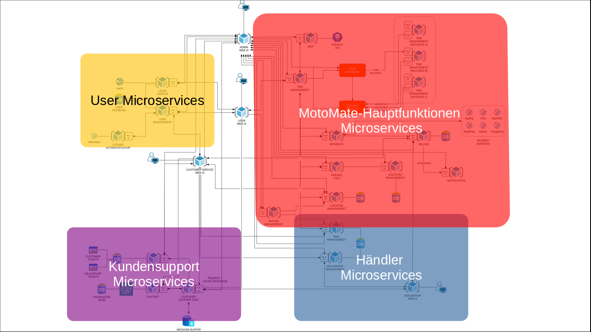

# Abgabe Moderne-SE-Architekturen

## Inhaltsverzeichnis
1. [Definition der Fallstudie](#Definition-der-Fallstudie)
	- [MotoMate](#MotoMate)
	- [Hauptfunktionen](#Hauptfunktionen)
2. [Personas](#Personas)
	- [Bernd Brummer](#Bernd-Brummer)
	- [Leon Ludwig](#Leon-Ludwig)
	- [Maike Müller](#Maike-Müller)
	- [Armin Angebot](#Armin-Angebot)
	- [Petra Byte](#Petra-Byte)
	- [Frank Fröhlich](#Frank-Fröhlich)
3. [User Stories](#User-Stories)
	- [Kunden](#Kunden)
	- [Motorradhändler](#Motorradhändler)
	- [Kundensupport](#Kundensupport)
	- [Administrator](#Administrator)
4. [Nichtfunktionale Anforderungen](#Nichtfunktionale-Anforderungen)
	- [Skalierbarkeit](#1-Skalierbarkeit)
	- [Globale Nutzung durch Datenbank Replikation](#2-Globale-Nutzung-durch-Datenbank-Replikation)
	- [Verfügbarkeit](#3-Verfügbarkeit)
5. [Architectual Decision Records](#ADR-Architectual-Decision-Records)
6. [Microservice Architektur](#Microservice-Architektur)
7. [Google Cloud Platform Products](#Google-Cloud-Platform-Products)
    - [Datenbanken](#Datenbanken)
    - [GKE Cluster](#GKE-Cluster)
    - [Weitere Produkte](#Weitere-Produkte)
    - [Kosten](#Kosten)

# Definition der Fallstudie
## MotoMate
> Shift into gear, MotoMate is here ~

MotoMate ist eine Anwendung, die es Benutzern ermöglicht, Motorradtouren zu buchen und sich ein passendes Fahrzeug für das Erlebnis auszuwählen. Für Motorradhändler bietet die Plattform eine einfache Möglichkeit, ihre Produkte an den Mann zu bringen.

## Hauptfunktionen
- **Fahrtenbuchung**
    - *Fahrzeugauswahl*
    - *Tourauswahl*
    - *Fahrpreiskalkulation*
- **Kundensupport**
    - *Ticketsystem*
    - *Chat-Funktion*
- **Admin Funktionen**
    - *Verwaltung*
    - *Wartung der Microservices*
    - *Rabattaktionen*
- **Händler Schnittstelle**
    - *Verwaltung angebotener Motorräder*
    - *Rechnungsportal*
- **Benachrichtigungen**
    - *Buchungsbestätigung*
    - *Zahlungsbestätigung*

# Personas

### Bernd Brummer

Alter: 34 Jahre | Nutzergruppe: User | Zielgruppe: Der Spezialist

> Fährt seit knapp 15 Jahren regelmäßig Motorrad und am liebsten mehrtätige Tagestouren (1-2 Tage). Ist sehr Technikaffin und interessiert sich für die neuesten Motorrad-Features. Er kann sich das neueste Motorrad momentan noch nicht leisten, würde aber gerne immer wieder die neuesten Modelle für seine Ausflüge nutzen können und ist auch bereit dafür ein wenig mehr Geld einzuplanen.

---

### Leon Ludwig

Alter: 52 Jahre | Nutzergruppe: User | Zielgruppe: Der Nostalgiker

> Ist 12 Jahre Motorrad gefahren, hat aufgrund seiner Familienplanung das Motorrad jedoch verkauft und träumt immer wieder davon, mal wieder ein paar Tage Motorrad zu fahren. Da seine Tocher nun älter wird, traut er sich wieder und informiert sich. Für ihn ist vor allem ein Gefühl der Nostalgie mit dem Fahren verbunden, er denkt an die Harley die er sich früher kaufen wollte. Ihm ist vor allem ein unkomplizierter Ablauf wichtig, da er nicht zu viel Zeit beim Suchen und dem Abschließen von Leistungen und Verträgen investieren möchte, sondern spontan an einem freien Tag wieder auf das Bike springen will. Für das erste entschließt er sich allerdings, eine der günstigeren Alternativen zu wählen.

---

### Maike Müller

Alter: 41 Jahre | Nutzergruppe: User | Zielgruppe: Die Markenliebhaberin

> Fährt bereits über 20 Jahre Motorrad und hat bereits verschiedene große Touren hinter sich. Bezeichnet sich als eine wahre Harley-Liebhaberin, fährt jedoch afugrund ihrer Familienplanung seit vielen Jahren eine weniger teure Maschine. Da ihre Kinder nun älter sind, würde sie an freien Tagen gerne mal wieder mit einer besonderen Harley fahren, da sie es sich wieder leisten kann. Sie hat bereits in der Vergangenheit eine Harley gemietet, da sie in einem Motorradclub ist und zu einem besonderen Anlass mit ihr im Konvoi mitgefahren ist. Für sie war dabei vor allem die Suche nach einer Harley lästig, da diese von wenigen Vermietern angeboten wurde.

---

### Armin Angebot

Alter: 28 Jahre | Nutzergruppe: Händler | Zielgruppe: Der Premium-Anbieter

> Verkauft und vermietet aus Leidenschaft Motorräder und hat einen Standort in der Nähe einer der bekanntesten Tour-Strecken im Sauerland. In seinem Angebot sind hauptsächlich High-End Motorräder und unwissende Kundenanfragen sind häufig überrascht von den entsprechenden Preisen. Ihn stört das nicht, diese Kategorie Motorradfahrer möchte er gar nicht in seinem Kundenstamm haben. Trotzdem wünscht er sich eine einfache Methode, schnell mit Kunden in Kontakt treten zu können, die wissen, was sie für ihr Geld bekommen werden.

---

### Petra Byte

Alter: 36 Jahre | Nutzergruppe: Mitarbeiter | Rolle: Administratorin

> Sie verfügt über umfangreiche Erfahrung in der Verwaltung und Überwachung von IT-Systemen und Nutzerplattformen. Mit einen Hintergrund in der Informatik hat sie ihre Karriere damit verbracht, effiziente, sichere und benutzer-freundliche Systeme zu entwickeln und zu pflegen. Petra hat eine proaktive Arbeitsweise und ist stets darauf bedacht, die Systemleistung zu optimieren und Risiken zu minimieren. Ihre analytischen Fähigkeiten und ihr strategisches Denken helfen ihr dabeu, komplexe Probleme effektiv zu lösen und die Plattform kontinuierlich weiterzuentwickeln.

---

### Frank Fröhlich

Alter: 26 Jahre | Nutzergruppe: Mitarbeiter | Rolle: Kundensupport

> Er bringt mehrere Jahre Erfahrung im Kundendienst mit, die er bei einem großen E-Commerce-Unternehmen gesammelt hat. Frank zeichnet sich durch seine Fähigkeit aus, schnell auf Kundenbedürfnisse zu reagieren und Lösungen auf empathische Weise zu vermitteln. Er ist technisch versiert und kann sich schnell in neue Software einarbeiten. Seine Stärken liegen in der Kommunikation und im Konfliktmanagement, was es ihm ermöglicht, auch in stressigen Situationen einen kühlen Kopf zu bewahren. Julia ist besonders motiviert, wenn sie ihren Kunden helfen kann, eine positive Erfahrung zu machen, und ist ständig auf der Suche nach Wegen, den Kundenservice zu verbessern.

# User Stories

### Kunden

1. Als **Kunde** möchte ich aus verschiedenen **Motorradoptionen auswählen** könnnen, um ein Fahrzeug zu finden, das meinen **Bedürfnissen** und meinem **Stil** entspricht.

2. Als **Kunde** möchte ich die **Bewertungen** und das **Feedback anderer Nutzer** über Motorräder einsehen können, um meine **Sicherheit** und **Komfort** zu gewährleisten.

3. Als **Kunde** möchte ich vorab den **Preis meiner Fahrt** kennen, um finanzielle Sicherheit zu haben und mein **Budget** entsprechend **zu planen**.

4. Als **Kunde** möchte ich in der Lage sein, meine **bevorzugten Zahlungsmethoden** zu verwenden, um Transaktionen **bequem und sicher** durchzuführen.

### Motoradhändler

1. Als **Motorradhändler** möchte ich ein **Buchungssystem anbieten** können, um Kunden die Möglichkeit zu geben, **Motorräder bequem und einfach zu reservieren**, was zu einer **höheren Kundenzufriedenheit** führt.

2. Als **Motoradhändler** möchte ich eine benutzerfreundliche **Schnittstelle für die Abwicklung von Zahlungen** verwenden, um Transaktionen reibungslos und sicher abwickeln zu können und somit das **Vertrauen der Kunden** zu erhöhen.

3. Als **Motorradhändler** möchte ich meine **Motträder auf einer Plattform präsentieren** können, um potentielle Kunden eine **Auswahl zu bieten** und ihere **Aufmerksamkeit zu gewinnen**.

4. Als **Motorradhändler** ist es mein Ziel, **gezielt Kunden anzusprechen**, die bereit sind, für hochwertige und teurere Motorradmodelle eine **hohe Zahlungsbereitschaft** zu zeigen.

### Kundensupport

1. Als **Kundensupportmitarbeiter** möchte ich auf **alle notwendigen Nutzerinformationen zugreifen** können, um **effiziente und effektive Unterstützung** anzubieten.

2. Als **Kundensupportmitarbeiter** möchte ich **Beschwerden und Anfragen schnell bearbeiten** können, um die **Kundenzufriedenheit zu maximieren**.

3. Als **Kundensupportmitarbeiter** möchte ich **spezielle Schulungen** zu Motorrad-spezifischen Problemen erhalten, **um kompetent beraten zu können**.

### Administrator

1. Als **Administrator** möchte ich Zugang zu einer **Übersicht aller aktiven Fahrten** haben, um den Betrieb der **Plattform effektiv überwachen** zu können.

2. Als **Administrator** möchte ich **Nutzerkonten verwalten** können, um sicherzustellen, dass die **Community-Richtlinien eingehalten werden**.

3. Als **Administrator** möchte ich **Werbeaktionen und Rabatte** einrichten können, um die **Nutzerbindung** zu erhöhen und **neue Kunden** anzuziehen.

# Nichtfunktionale Anforderungen

### 1. Skalierbarkeit
Skalierbarkeit ist entscheidend, um auf Änderungen in der Nachfrage flexibel reagieren zu können. Für MotoMate bedeutet dies, dass die Plattform so gestaltet sein muss, dass sie eine wachsende Anzahl von Nutzern und Buchungen ohne Beeinträchtigung der Leistung handhaben kann. Wenn also immer mehr Motorradfahrer und Fahrgäste in verschiedenen Städten MotoMate nutzen, kann die Plattform diese steigende Nachfrage bewältigen, indem sie beispielsweise mehr Serverressourcen bereitstellt oder die Software so optimiert, dass sie effizienter läuft.

Mögliche technische Strategien:
- *Leistungsfähigkeit der Server erhöhen*, z.B. mehr RAM, schnellere CPUs oder größere Speicher.
- *Mehr Server oder Cloud-basierte Dienste nutzen*, die automatisch mehr Ressourcen bereitstellen, wenn die Nachfrage steigt. Auch in Spitzenzeiten, wie während der Urlaubszeit oder großen Events in Städten, werden Nutzer eine reibungslose und schnelle Erfahrung haben.

### 2. Globale Nutzung durch Datenbank Replikation
Um MotoMate auch international nutzbar zu machen, ist es sinnvoll, Kopien der Datenbank in verschiedenen Ländern zu speichern. Diese Datenbank-Replikation sorgt dafür, dass Nutzer schnellen Zugriff auf notwendige Daten wie Fahrerverfügbarkeiten oder Buchungsinformationen haben, unabhängig davon, wo sie sich befinden.

Mögliche technische Strategie:
- *Replikation* bedeutet, dass Kopien der Hauptdatenbank an verschiedenen Orten gespeichert werden, um sicherzustellen, dass Daten schnell geladen und Transaktionen zeitnah durchgeführt werden können. Das nicht nur verbessert die Nutzererfahrung durch schnelleren Zugriff und höhere Geschwindigkeit der App, sondern erhöht auch die Ausfallsicherheit: Sollte eine Datenbank ausfallen, können Anfragen automatisch an eine andere, funktionierende Kopie umgeleitet werden.

### 3. Verfügbarkeit
Verfügbarkeit bedeutet, dass die Service-Plattform fast immer erreichbar und funktionsfähig ist. Für MotoMate heißt das, dass die Nutzer zu jeder Tageszeit Fahrten buchen oder anbieten können.

Mögliche Technische Strategien:
- *Failover-Systeme*: Automatisierte Prozesse, die den Dienst zu einem sekundären System umleiten, sollten das primäre System ausfallen.
- *Load Balancing*: Verteilung des Datenverkehrs auf mehrere Server, um Überlastung zu vermeiden und die Antwortzeiten zu verkürzen.
- *Regelmäßige Wartung und Updates*: Durch das regelmäßige Aktualisieren der Software und Hardware sowie durch vorbeugende Wartung können viele Probleme vermieden werden, bevor sie die Verfügbarkeit beeinträchtigen.
- *Monitoring und Alerting*: Echtzeitüberwachung der Systeme kann ungewöhnliche Aktivitäten erkennen und automatisch Alarme auslösen.

# Architectural Decision Records
- <a href="./adr-001.md" target="_blank">ADR-001: Skalierbarkeit für MotoMate</a>

# Mircoservice Architektur

Die Microservice Architektur lässt sich am einfachsten nachvollziehen, indem man die Microservices zum Verständnis in vier Teilbereiche unterteilt:

- Schema ohne Admin: <a href="./microservices.png" target="_blank">Link</a>
- Schema nur Admin: <a href="./microservices-admin.png" target="_blank">Link</a>
- Schema Vollständig: <a href="./microservices-all.png" target="_blank">Link</a>

# Google Cloud Platform Products

## Datenbanken
Aufgrund der verschiedenen Anforderungen an die Funktionalität der diversen MotoMate-Datenbanken haben wir uns für eine Kombination aus verschiedenen Produkten entschieden:

1. **Cloud SQL**
- Datenbanken: User DB, Bike DB, Locations DB, Discount DB, Billing DB
- Begründung:
    - Managed Service: Google übernimmt die Aufgabe von bspw. Backups und Updates, was die administrativen Aufgaben des MotoMate Teams reduziert
    - Flexibilität: Wir sind flexibel in der Auswahl zwischen MySQL und PostgreSQL
    - Skalierbarkeit: Cloud SQL ist sowohl vertikal als auch horizontal skalierbar
2. **Cloud Firestore**
- Datenbank: Ticket DB
- Begründung:
    - Bezahlung per Read and Write counts: Tickets werden i.d.R. nur wenige Male bearbeitet und schnell geschlossen
    - Wir rechnen mit wenig bis medium vielen Ticketeinträgen in der Datenbank
    - JSON-Format: JSON erleichtert die Aufbereitsweise eine Ticket-Modells
3. **Cloud Redis**
- Datenbank: Chatbot Knowledge DB
- Begründung:
    - Funktionalität des Chatbots erfordert schnelle Reads

## GKE Cluster
- Annahmen:
    - Als globale Platform rechnen wir mit ca. 5 Mio. Request pro Tag, daraus ergeben sich 58 Req./Sek.
    - Hierbei handelt es sich um eine Überschlagsrechnung, die 3 ausgewählten Use Cases decken einen großteil der Microservices ab
    - Rechnung:
        - Buchung: 58 Req./Sek. * 8 Microservices
        - Bike Management: 58 Req./Sek. * 3 Microservices
        - Kundensupport-Chat: 5 Req./Sek. * 12 Microservices 
            - Anmerkung: Requestanzahl wurde reduziert, weil nicht jeder User ein Support-Anliegen hat. Microservice Request/Response Zahl wurde erhöht, weil mehrere Nachrichten ausgetauscht werden
        - Ergebnis: 648 Req./Sek.
        - 1 Instanz kann 50 Req./Sek. verarbeitet -> 13 Instanzen
        - 1 Instanz = 13 CPUs & 16 GB -> **4 Nodes mit jeweils 4 CPUs und 13 GB** (Teilweise aufgerundet, weil beim Konfigurator bei manchen Kriterien nur 2er-Schritte eingestellt werden konnten)

## Weitere Produkte
- **BigQuery**: Wir möchten das Nutzerverhalten auswerten und Datenanlyse bei den Kombinationen aus Tour-, Mottorad-, und Zeitraumbuchung betreiben.
- **PubSub**: Der Messaging Dienst von Google wird für den Kundensupport-Chat und dem Benachrichtigungsdienst eingesetzt.
- **Load Balancer**: In Peak-Zeiten möchten wir genügend Instanzen des Buchungssystems anbieten können, um mit der erhöhten Anzahl an Anfragen umgehen zu können.

## Kosten
- Die Kosten der oben genannten Produkte belaufen sich auf Kosten in Höhe von **2.751,32 EUR** pro Monat
    - <a href="https://cloud.google.com/products/calculator/estimate-preview/7ab2c737-58fd-46b4-a073-b3a524b5a38a" target="_blank">Web-Link</a>
    - <a href="./google-cost-estimate.csv" target="_blank">CSV</a>
- Unter Berücksichtigung der Nichtfunktionalen Anforderung *Datenbank Replikation* bei insgesamt 5 gespiegelten Standorten sind die tatsächlichen Gesamtkosten **7.993,16 EUR** pro Monat
